# **Employee Attrition Prediction**

This project aims to predict employee attrition within an organization using machine learning models. By identifying potential factors leading to employee resignation, organizations can take proactive measures to improve employee retention and satisfaction.

---

## **Dataset Information**

- **Source**: [IBM HR Analytics Employee Attrition Dataset](https://www.kaggle.com/datasets/pavansubhasht/ibm-hr-analytics-attrition-dataset)  
- The dataset contains various features related to employee demographics, job roles, satisfaction levels, and performance.  

### **Dataset Structure**
- **Total Records**: 14,999 rows  
- **Columns**: 35  
  - **Categorical Variables**:  
    - `Education`, `EnvironmentSatisfaction`, `JobInvolvement`, `JobSatisfaction`, `PerformanceRating`, `RelationshipSatisfaction`, `WorkLifeBalance`, `BusinessTravel`, `Department`, `EducationField`.  
  - **Numerical Variables**:  
    - `Age`, `DailyRate`, `DistanceFromHome`, `MonthlyIncome`, `YearsAtCompany`, `TotalWorkingYears`, etc.  
  - **Target Variable**:  
    - `Attrition` (indicating whether an employee resigned).  

---

## **Data Preprocessing**

1. **Handling Missing Values**:  
   - Dataset contained **1.5% missing values**, which were dropped as their impact was minimal.  

2. **Outlier Detection and Removal**:  
   - Outliers were identified in numerical features like `EnvironmentSatisfaction`, `PerformanceRating`, `YearsAtCompany`, etc.  
   - Outliers were capped using the **90th percentile (quantile capping)**.  

3. **Feature Selection**:  
   - **Chi-Square Test** was performed to identify significant features.  
   - Insignificant features such as `EmployeeNumber`, `ApplicationID`, `Over18`, `StandardHours`, and `PerformanceRating` were dropped.  

4. **Categorical Encoding**:  
   - Categorical variables (e.g., `BusinessTravel`, `Department`, `EducationField`) are encoded using **Label encoder**.  

5. **Feature Engineering**:  
   - Highly correlated variables (e.g., `YearsAtCompany`, `YearsWithCurrManager`, `YearsSinceLastPromotion`) were merged using **PCA (Principal Component Analysis)**.  

6. **Data Balancing**:  
   - As the dataset was imbalanced (more retained employees than resigned), **SMOTE (Synthetic Minority Oversampling Technique)** was used to balance the data.
     

---

## **Exploratory Data Analysis (EDA)**

### **Key Insights**  
1. **Satisfaction Levels**:  
   - Most employees rated their environment and job satisfaction as **3 (High)** or higher.
  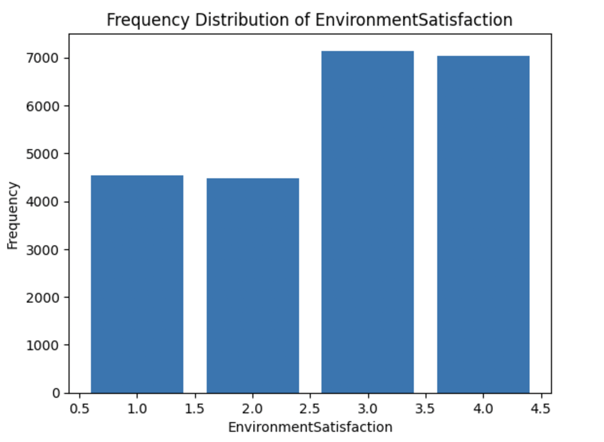  
2. **Work Tenure**:  
   - Majority of employees worked at the company for **less than 10 years**.
  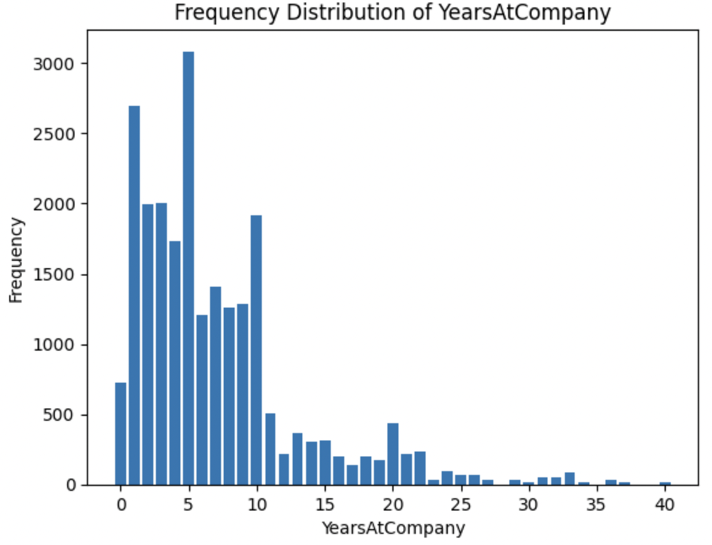  
  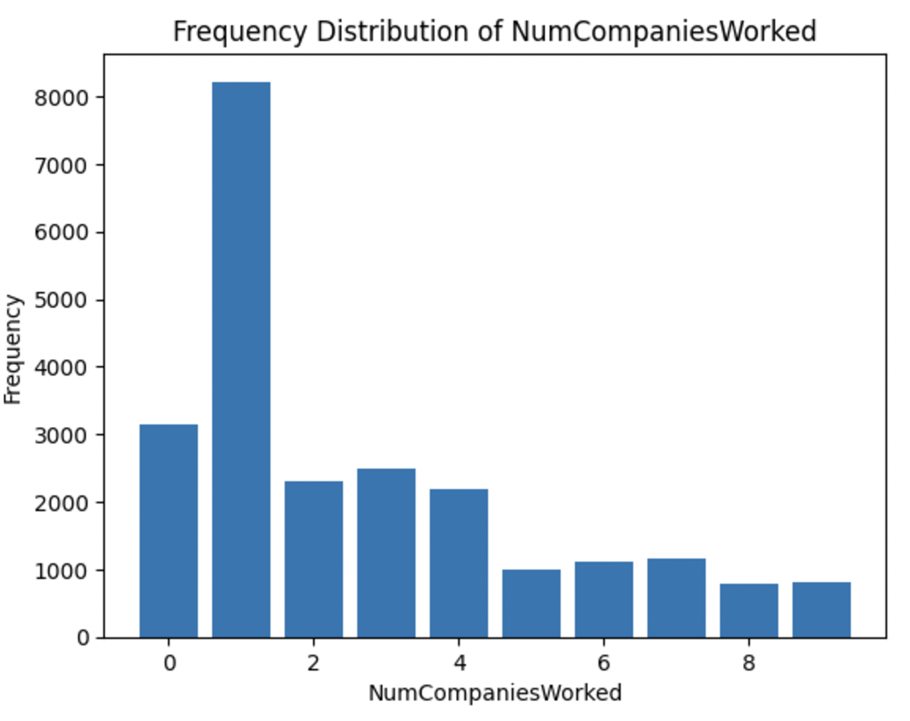  
3. **Age Distribution**:  
   - Follows a normal distribution between **18 and 60 years**, with most employees around **30 years old**.  
4. **Promotion History**:  
   - Most employees received their last promotion less than a year ago.
  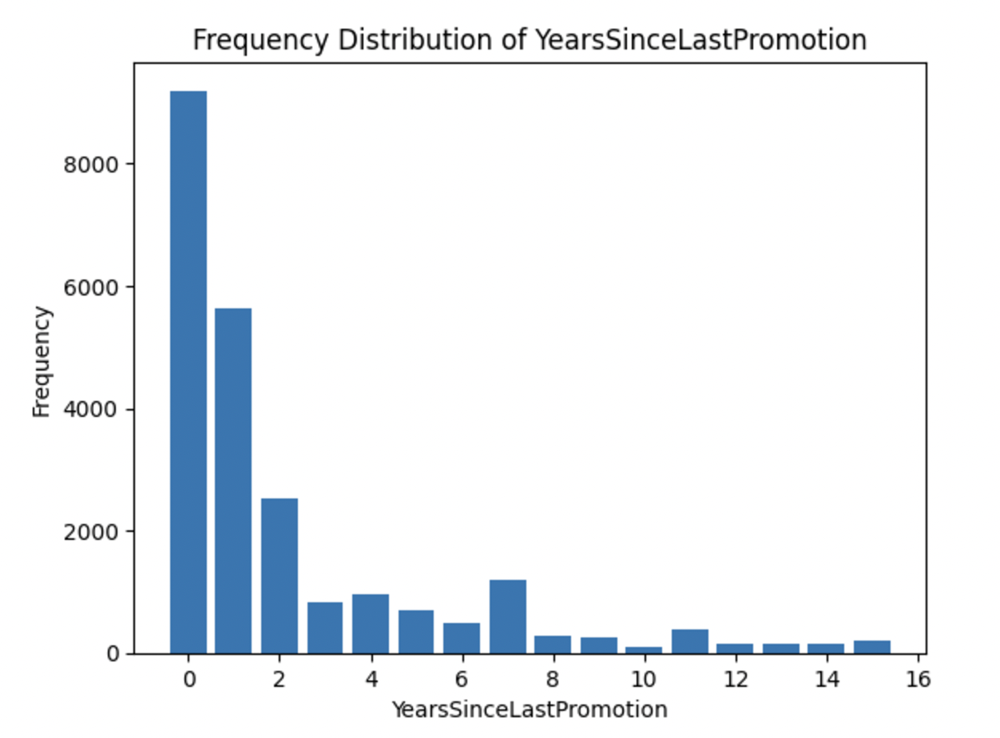  

### **Correlation Analysis**  
- `YearsAtCompany`, `YearsInCurrentRole`, and `YearsSinceLastPromotion` showed significant correlations.  
- After merging correlated features and removing insignificant ones, final features were selected for model building.  
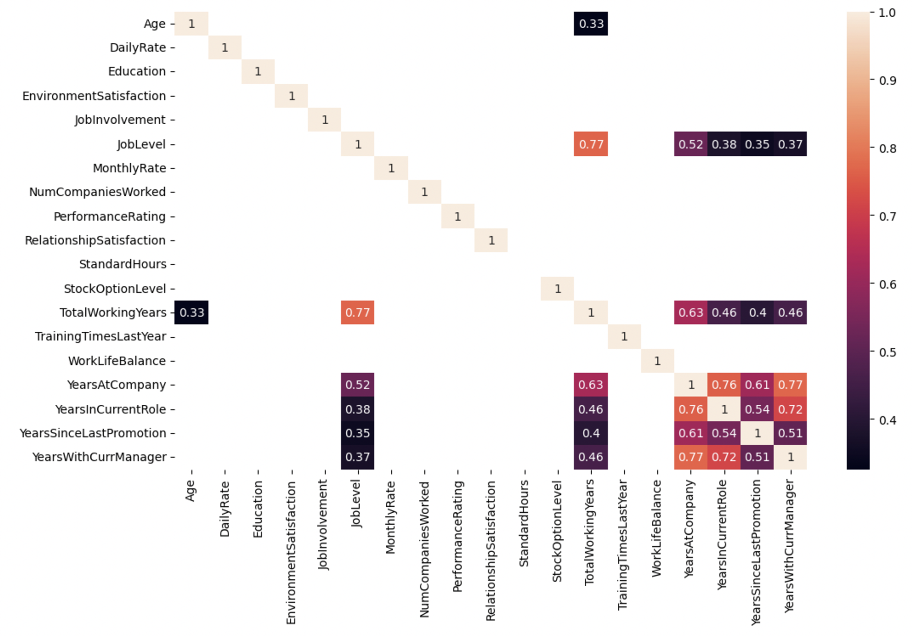  

---

## **Model Building**

Data was split into **60% training** and **40% testing**. **K-Fold Cross-Validation (K=5)** was used to validate model performance.  

### **Models Evaluated**
| **Model**                  | **Accuracy** | **Precision** | **Recall** | **F1-Score** |  
|----------------------------|--------------|---------------|------------|--------------|  
| Logistic Regression        | 84%          | 0.87          | 0.50       | 0.46         |  
| Decision Tree              | 99%          | 0.99          | 0.99       | 0.99         |  
| Random Forest (Tuned)      | **93%**      | **0.93**      | **0.87**   | **0.90**     |  
| K-Nearest Neighbors (KNN)  | 95%          | 0.92          | 0.89       | 0.90         |  

---

## **Final Model Selection**

The **Random Forest Classifier** was chosen as the final model for the following reasons:  
1. **Minimizing False Negatives**:  
   - Focused on **lower recall** to ensure that employees who are likely to quit are not classified as retained (false negatives).  
2. **Balanced Metrics**:  
   - It provided a good balance between precision, recall, and F1-score, achieving an accuracy of **93%**.  

---

## **Hyperparameter Tuning**

Random Forest was optimized using **GridSearchCV**.  

### **Hyperparameters Tuned**:  
- `max_depth=20`  
- `min_samples_leaf=10`  
- `min_samples_split=20`  
- `n_estimators=50`  

### **Performance Results**  
- **Training Accuracy**: 85%  
- **Testing Accuracy**: 93%
- 
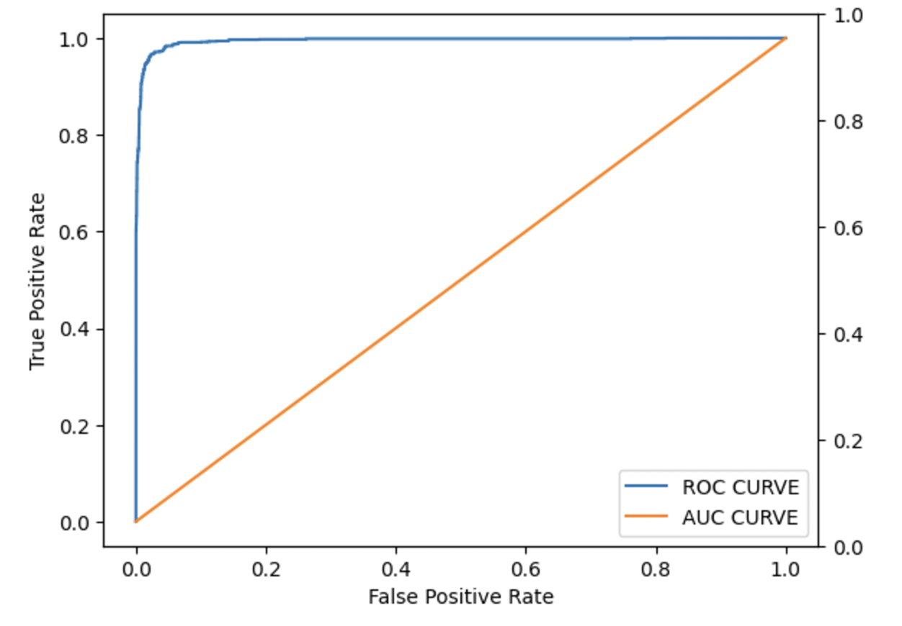  
---

## **Visualizations and Techniques**

1. **Feature Importance**:  
   - Key features influencing attrition were identified:  
     - `DailyRate`, `Age`, `MonthlyIncome`, `DistanceFromHome`, `TotalWorkingYears`, `TrainingTimesLastYear`.
  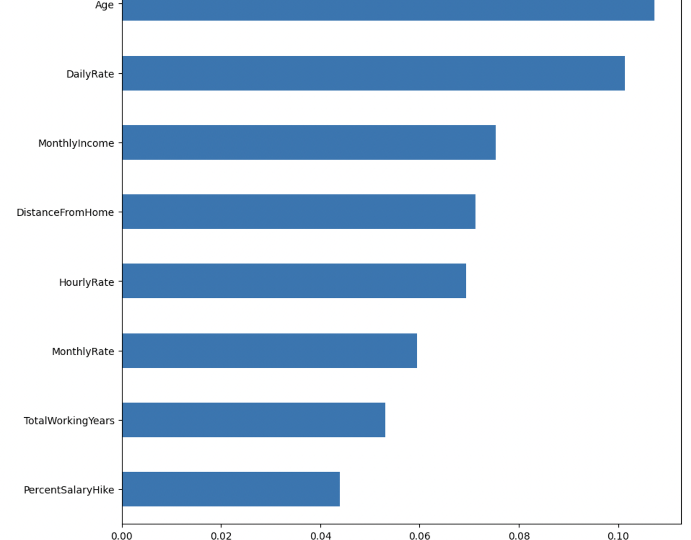  
2. **Learning Curve Analysis**:  
   - Training and testing accuracy vs. hyperparameters were plotted to avoid overfitting.
     
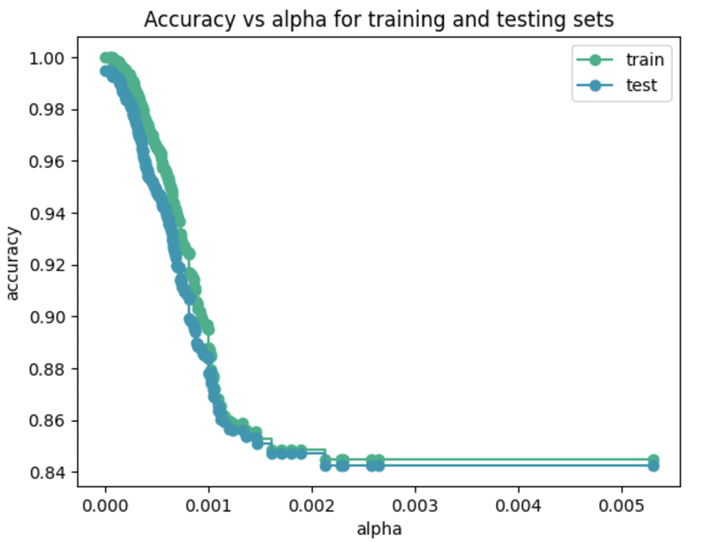

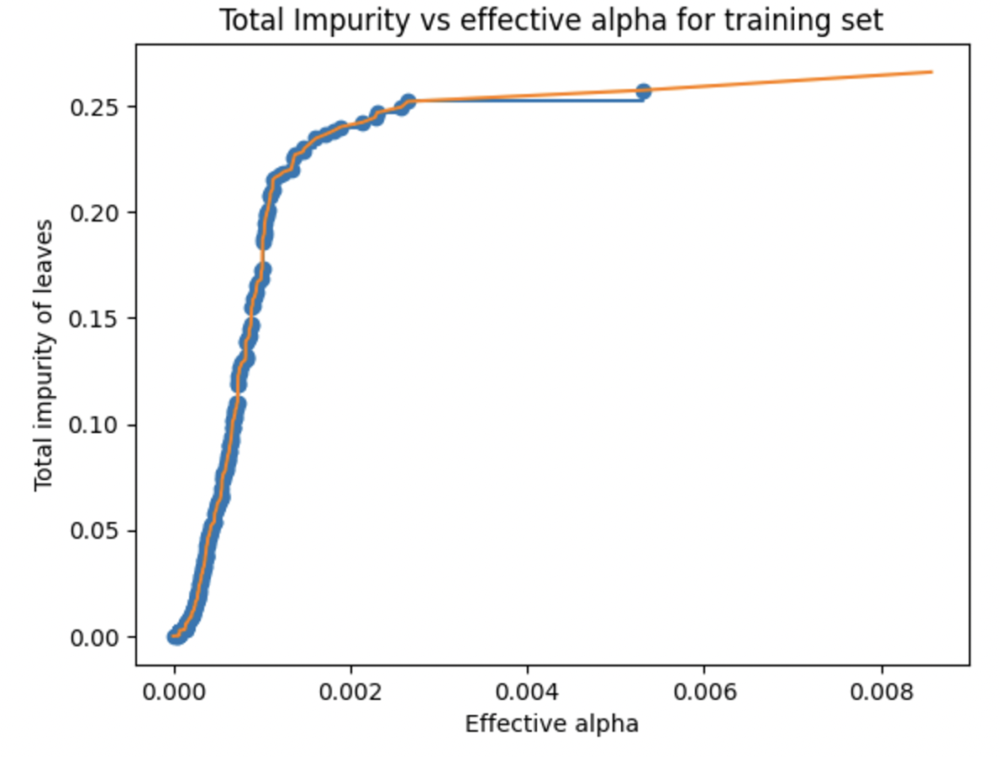  

3. **KNN Elbow Method**:  
   - `K=1` was chosen for minimal bias and variance trade-off.  
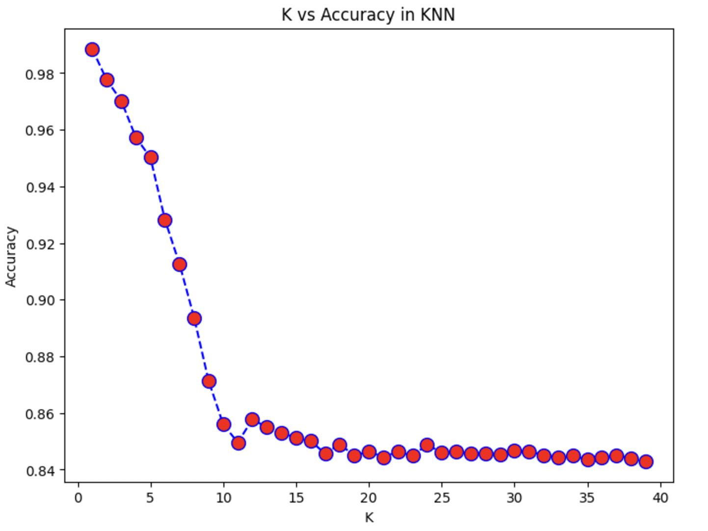
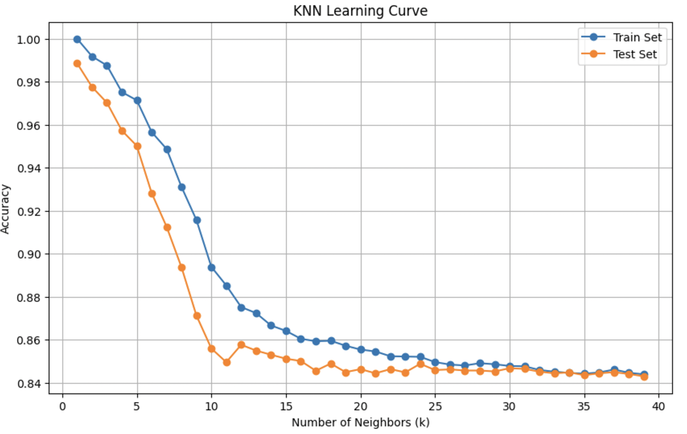  

---

## **Future Scope**

1. **Enhanced Models**: Explore advanced models like **XGBoost** or **ANN** for better performance.  
2. **Explainable AI**: Use interpretability techniques like SHAP to analyze the impact of features on predictions.  
3. **Integrated Data**: Incorporate additional external factors like market trends and organizational changes for richer predictions.  

---

## **How to Run## **

### **Setup**
1. Install required libraries:  
   ```bash
   pip install pandas numpy scikit-learn imbalanced-learn

---

## **Conclusion**
This project provides a comprehensive approach to predicting employee attrition using machine learning. By leveraging the Random Forest Classifier and addressing class imbalance with SMOTE, the model achieves a high recall for employees likely to leave.
The insights derived can help organizations develop effective retention strategies.


